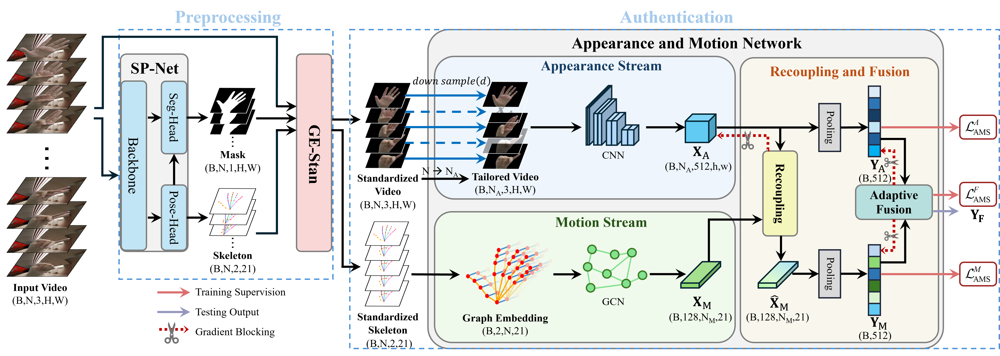
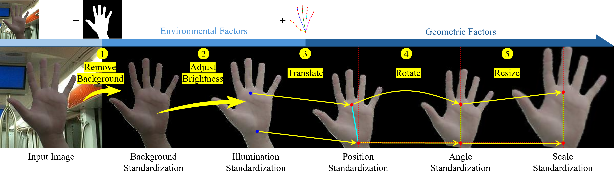
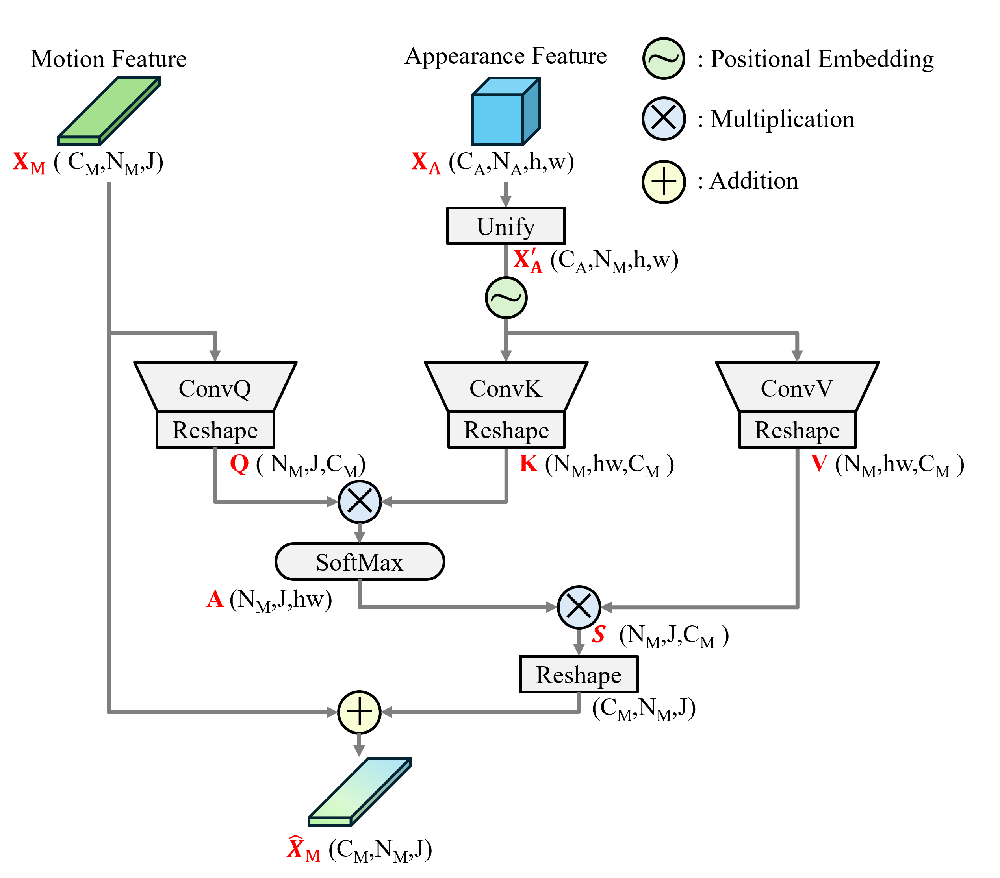
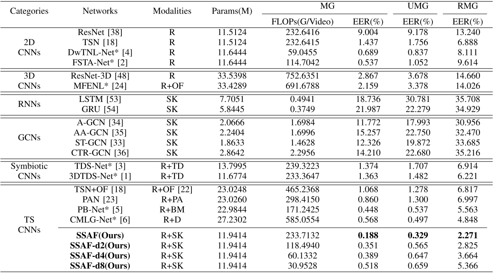
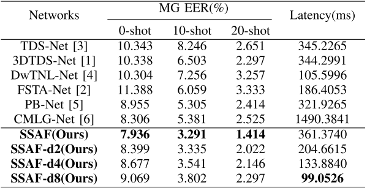

# SSAF: Enhancing Perceptron Constancy for Real-World Dynamic Hand Gesture Authentication

[](https://ieeexplore.ieee.org/document/11316175)
[](https://github.com/SCUT-BIP-Lab/SCUT-RealDHGA)
[](LICENSE)

Official PyTorch implementation of **SSAF** (Skeleton-assistant Standardization and Authentication Framework), a novel framework for robust and efficient dynamic hand gesture authentication in real-world uncontrolled scenarios.

> **Yufeng Zhang, Xilai Wang, Wenwei Song, and Wenxiong Kang**  
> *IEEE Transactions on Information Forensics and Security (TIFS), 2026*

---

## Overview

Dynamic hand gesture authentication (DHGA) combines physiological and behavioral traits for high-security user verification. However, existing methods suffer from poor generalizability due to data distribution discrepancies across sessions and environments. SSAF addresses this with:

- **GE-Stan**: A generic preprocessing module that standardizes background, illumination, palm position, angle, and scale.
- **AM-Net**: A two-stream network decoupling appearance (physiological) and motion (behavioral) features, with an attention-based recoupling mechanism.

  

---

## Key Features

- ✅ **State-of-the-art** accuracy on three DHGA datasets (SCUT-DHGA, SCUT-DHGA-br, SCUT-RealDHGA)
- ✅ **3.6× efficiency boost** with minor accuracy trade-off via temporal downsampling
- ✅ **Generic preprocessing** – plug GE-Stan into most existing DHGA algorithms for significant improvement
- ✅ **Real-world dataset** – SCUT-RealDHGA with 10 gesture types, diverse backgrounds/illumination, 60 subjects
- ✅ **Portable deployment** – runs on NVIDIA Xavier edge device with <100ms latency

---

## Method Highlights

### 1. GE-Stan Module
Standardizes 5 factors causing distribution shifts:

| Factor | Standardization Method |
|--------|------------------------|
| Background | Hand segmentation mask |
| Illumination | Brightness normalization |
| Position | Translate palm root to center |
| Angle | Rotate to align center line |
| Scale | Resize to fixed palm length |

  

### 2. AM-Net Architecture

- **A-stream (Appearance)**: ResNet18 on sampled RGB frames
- **M-stream (Motion)**: Lightweight A-GCN on skeleton sequences (21 keypoints)
- **Recoupling**: Cross-attention to inject appearance semantics into motion features
- **Adaptive Fusion**: Learnable weighted fusion of both streams

  

---

## Dataset: SCUT-RealDHGA

| Statistic | Value |
|-----------|-------|
| Subjects | 60 |
| Gesture types | 10 (9 defined + 1 random) |
| Modalities | RGB + Depth |
| Videos | 7,200 |
| Frames | 864,000 (30 fps, 4s each) |
| Scenes | Dormitory, classroom, subway, public hall, etc. |

  

The SCUT-RealDHGA dataset can be downloaded from [SCUT-RealDHGA](https://github.com/SCUT-BIP-Lab/SCUT-RealDHGA).

---

## Results

### Accuracy and Efficiency Comparison on SCUT-DHGA (EER %)

  

### Cross-Dataset Generalization (RD dataset, MG EER %)

  

---

## Quick Start

### Prerequisites
- Python 3.8+
- PyTorch 2.40+

### Installation

```bash
git clone https://github.com/SCUT-BIP-Lab/SSAF.git
cd SSAF
pip install -r requirements.txt
```

### Data Preparation
1. Download datasets: SCUT-DHGA, SCUT-DHGA-br, SCUT-RealDHGA
2. Organize as:
```text
data/
├── SCUT-DHGA/
│   ├── color_hand
│   └── keypoint
├── SCUT-DHGA-br/
└── SCUT-RealDHGA/
```
3. Normalize the data using GE‑Stan:
```bash
python src.utils/GE-Standardization.py
```
4. The normalized data will be stored as:
```text
data_norm/
├── SCUT-DHGA/
│   ├── color_hand_norm
│   └── keypoint_norm
├── SCUT-DHGA-br/
└── SCUT-RealDHGA/
```

### Training
```bash
# Train SSAF on SCUT-DHGA under MG protocol
python ./train.py --conf_file ./conf/SSAF/MG/MG_SD_AMNet.conf --mode train
```

### Evaluation
```bash
# Evaluate SSAF on SCUT-DHGA under UMG protocol
python ./train.py --conf_file ./conf/SSAF/UMG/UMG1_SD_AMNet.conf --mode eval
```

### Citation
If you find this work useful, please cite:
```text
@ARTICLE{zhang2026ssaf,
  author={Zhang, Yufeng and Wang, Xilai and Song, Wenwei and Kang, Wenxiong},
  journal={IEEE Transactions on Information Forensics and Security}, 
  title={Enhancing Perceptron Constancy for Real-World Dynamic Hand Gesture Authentication}, 
  year={2026},
  volume={21},
  number={},
  pages={886-899},
  keywords={Authentication;Hands;Physiology;Accuracy;Skeleton;Videos;Robustness;Feature extraction;Standardization;Lighting;Biometrics;hand gesture authentication;preprocessing;skeleton-based;behavior analysis},
  doi={10.1109/TIFS.2025.3648567}}
```

### Contact
**Biometrics and Intelligence Perception Lab**  
College of Automation Science and Engineering  
South China University of Technology, Guangzhou, China  

- **Yufeng Zhang**: auyfzhang@mail.scut.edu.cn  
- **Xilai Wang**: auwangxilai@mail.scut.edu.cn  
- **Wenxiong Kang**: auwxkang@scut.edu.cn

### License
MIT License. See [LICENSE](https://github.com/SCUT-BIP-Lab/SSAF/blob/main/LICENSE) for details.
